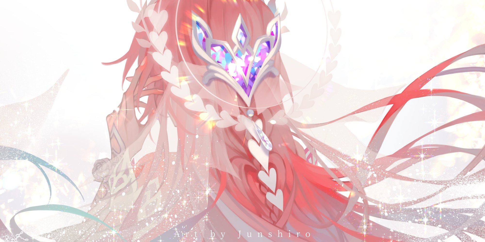

<div align="center">



# 🌸 HSR Light Cone Shelf API

A small educational REST API inspired by **Honkai: Star Rail**.


</div>

## 🌷 About

This is a simple learning project created to practise:

- building a REST API with FastAPI;
- working with Pydantic models;
- validating data;
- using GET, POST, PUT and DELETE requests.

The API stores a small collection of Light Cones and allows you to view, create, update and delete them.

> The project does not use a real database.  
> All changes are reset after restarting the application.

## 🎀 Project structure

```text
main.py    — FastAPI application and endpoints
models.py  — Light Cone model and validation
data.py    — initial Light Cone collection
